# FMCW-LiDAR Data Archaeology

## 1. Representative visualizations

### Evidence boundary and analyzed windows

| Sequence | Raw-bag window | Label evidence | Conclusion confidence |
|---|---:|---|---|
| 100 m v10 | source frames 0–45, 46 consecutive frames | Four GNSS waypoints define an approximate 105–120 m horizontal range and 6.9–12.8 m relative-height envelope, but GNSS and bag are not time/extrinsic synchronized | High confidence that no usable return exists in the tested broad envelope; no point-level UAV ground truth |
| 300 m v10 | source frames 7–56, 50 consecutive frames (the same window used by the existing PCD set) | Smooth isolated airborne track, manually checked and trajectory-guided within a narrow ROI | Moderate-confidence pseudo ground truth |
| cross | source frames 0–59, 60 consecutive frames | Very clear isolated airborne track with two reversals, manually checked and trajectory-guided within a narrow ROI | High-confidence pseudo ground truth, but still not true ground truth |

No synchronized point-level true ground truth was found. The 300 m and cross labels therefore remain **manual/trajectory-guided pseudo ground truth**. Their frame summaries are in [`uav_pseudo_labels.csv`](results/data_archaeology/cross/uav_pseudo_labels.csv), and every labeled point—with frame/timestamps, xyz, range, radial velocity, and intensity—is in [`uav_pseudo_points.csv`](results/data_archaeology/cross/uav_pseudo_points.csv) and the corresponding [300 m file](results/data_archaeology/300m/uav_pseudo_points.csv).

Each `*_raw_views.png` contains BEV x–y and side x–z colored separately by intensity and radial velocity, plus range–radial-velocity scatter/density. Each `*_pipeline.png` shows Raw → intensity → height → background → neighborhood → final cluster output.

### 100 m v10

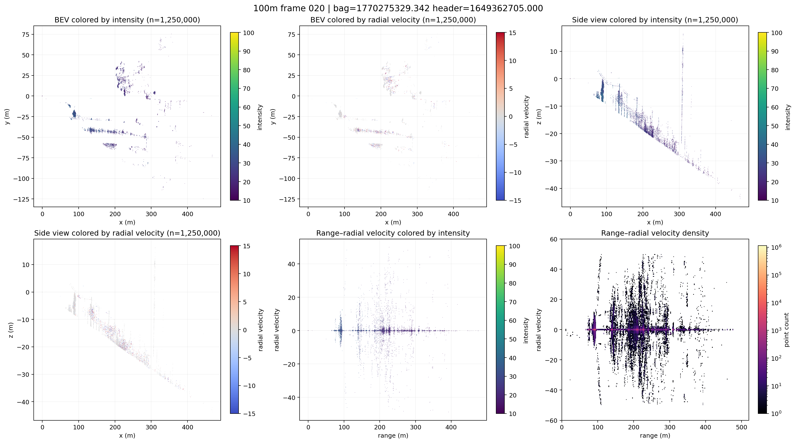

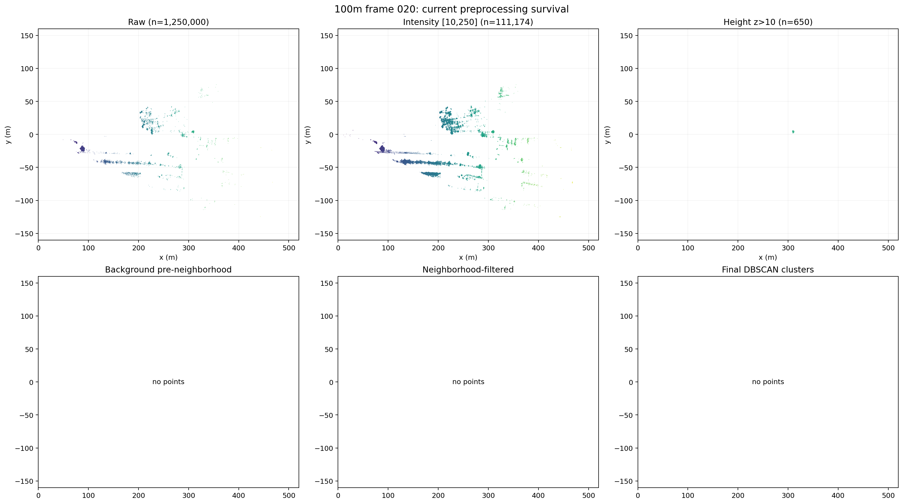

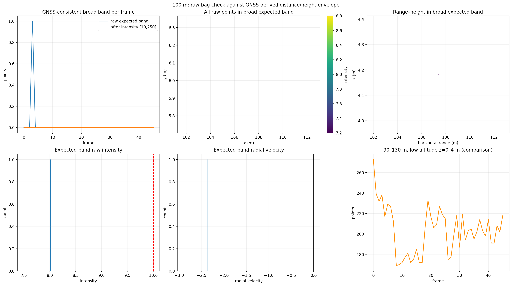

The raw view contains strong terrain/structure returns, but not an elevated moving object near the GNSS-consistent 100 m airspace. The broad search deliberately expands the GNSS envelope to 90–130 m horizontal range and z=4–16 m to avoid pretending that time, yaw, or extrinsic calibration is exact.

### 300 m v10

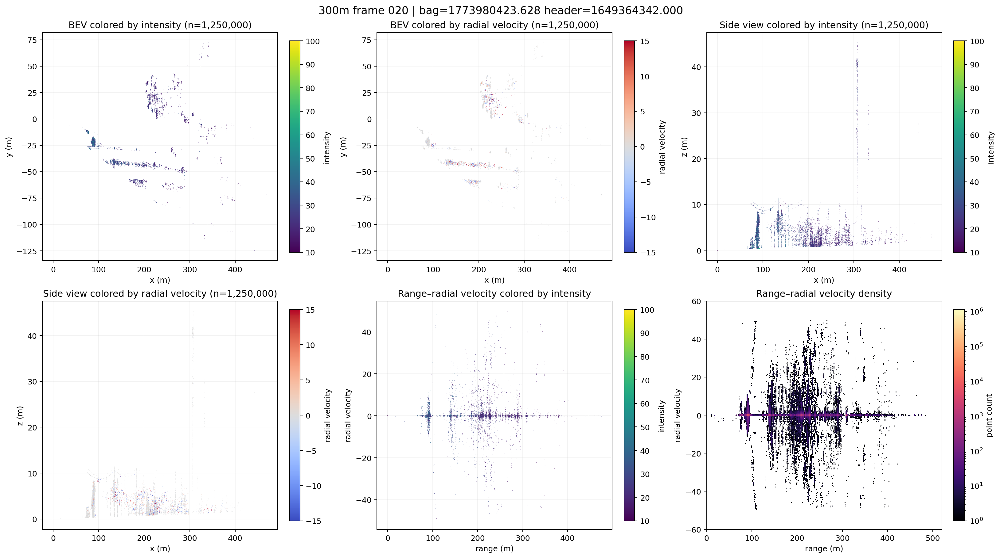

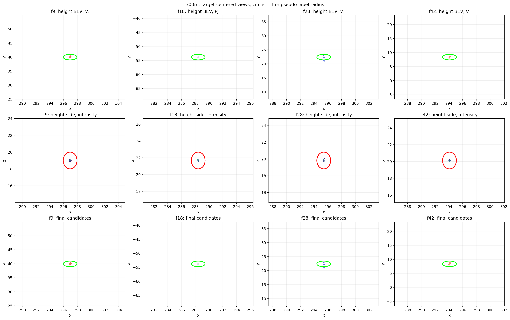

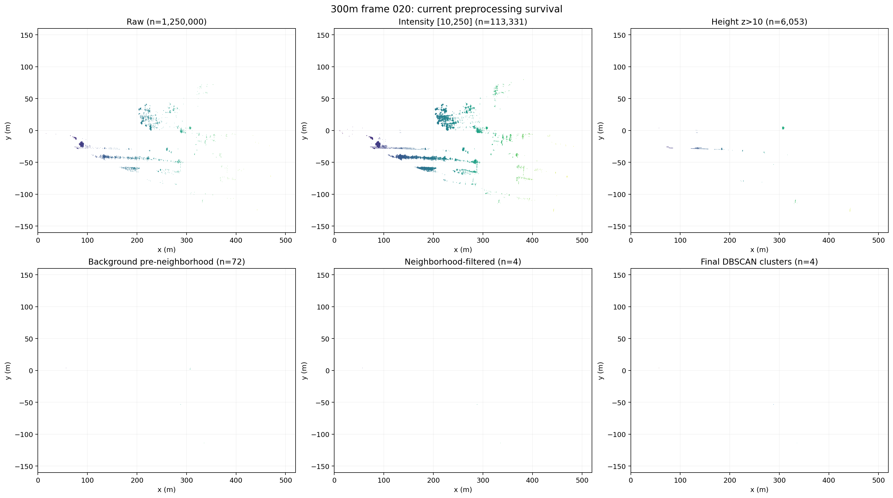

The candidate is a compact 0–20 point object around x=288–299 m and z=18.6–21.7 m. Its y coordinate traverses approximately +65 m → −54 m → +65 m and later returns toward y≈−5 m. It is spatially distinct from the much denser static structure around x≈307 m.

### Cross sequence

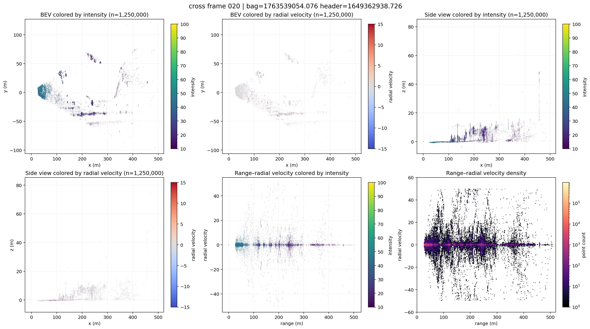

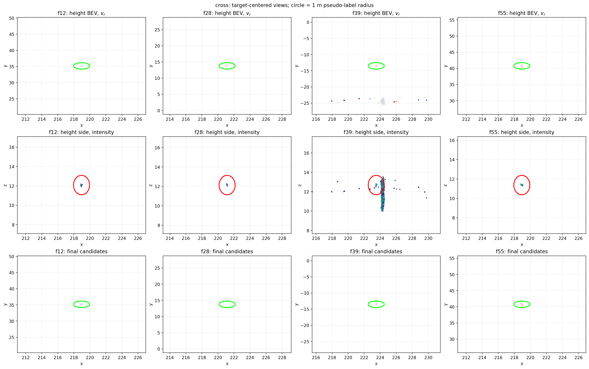

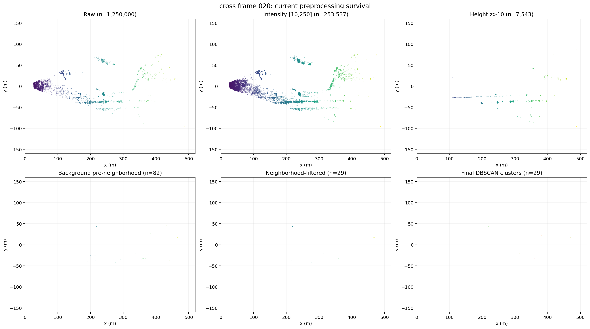

The candidate is a compact 0–21 point object around x=218–223 m and z=11–13 m. Its y coordinate follows a smooth repeated traverse, approximately +7 m → +51 m → −13.5 m → +46 m → +19 m. In frame 39 the side view overlaps a dense static structure, while BEV still separates the target in y; this is a useful example of why a single projection is insufficient.

Additional representative frames are stored beside these figures for frames 8/20/35/45 (100 m), 8/20/35/49 (300 m), and 8/20/40/59 (cross).

## 2. UAV point-count statistics

Here, \(N_{UAV}(t)\) is the number of intensity-surviving, height-surviving points within 1 m of the manually checked trajectory center. It is **not** the total dynamic-candidate count. The 100 m sequence is not assigned \(N_{UAV}=0\), because there is no synchronized point-level label; its absence evidence is reported separately.

| Sequence | Frames | Mean | Median | Min–max | 0 | 1 | 2 | 3–5 | 6–10 | >10 |
|---|---:|---:|---:|---:|---:|---:|---:|---:|---:|---:|
| cross | 60 | 8.32 | 8 | 0–21 | 1.7% | 0% | 1.7% | 20.0% | 53.3% | 23.3% |
| 300 m | 50 | 3.96 | 3 | 0–20 | 30.0% | 2.0% | 14.0% | 30.0% | 16.0% | 8.0% |

The cross target is weak per frame but almost continuously visible. The 300 m target is substantially less reliable: 15 of 50 frames contain no point in the interpolated target neighborhood.

Point count versus range, within the limited range variation of each trajectory:

| Sequence and range bin | Frames | Mean points | Median | Min–max |
|---|---:|---:|---:|---:|
| cross 221.36–222.09 m | 22 | 8.23 | 8.0 | 2–21 |
| cross 222.09–222.82 m | 14 | 7.71 | 7.5 | 0–14 |
| cross 222.82–223.55 m | 12 | 9.83 | 9.0 | 5–17 |
| cross 223.55–224.27 m | 12 | 7.67 | 7.0 | 3–13 |
| 300 m 293.01–296.50 m | 26 | 3.54 | 3.5 | 0–9 |
| 300 m 296.50–299.99 m | 4 | 3.25 | 2.5 | 0–8 |
| 300 m 299.99–303.48 m | 6 | 11.00 | 12.5 | 2–20 |
| 300 m 303.48–306.97 m | 14 | 1.93 | 0.5 | 0–8 |

There is no statistically supported monotonic within-sequence relation in these narrow windows: Spearman \(\rho=0.020\) for cross and \(-0.105\) for 300 m. The non-monotonic 300 m bins are also confounded with flight phase, path revisit, and missing frames; they must not be interpreted as a general range law.

## 3. UAV survival through preprocessing

Aggregate labeled-point survival:

| Sequence | Raw | Intensity | Height | Background | Neighborhood | Cluster |
|---|---:|---:|---:|---:|---:|---:|
| cross, points | 504 | 499 | 499 | 438 | 419 | 419 |
| cross, fraction of raw | 100% | 99.0% | 99.0% | 86.9% | 83.1% | 83.1% |
| 300 m, points | 200 | 198 | 198 | 163 | 163 | 163 |
| 300 m, fraction of raw | 100% | 99.0% | 99.0% | 81.5% | 81.5% | 81.5% |

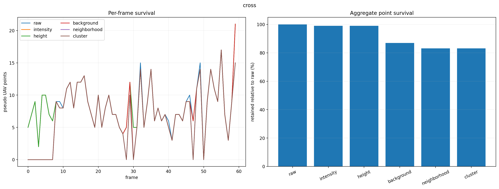

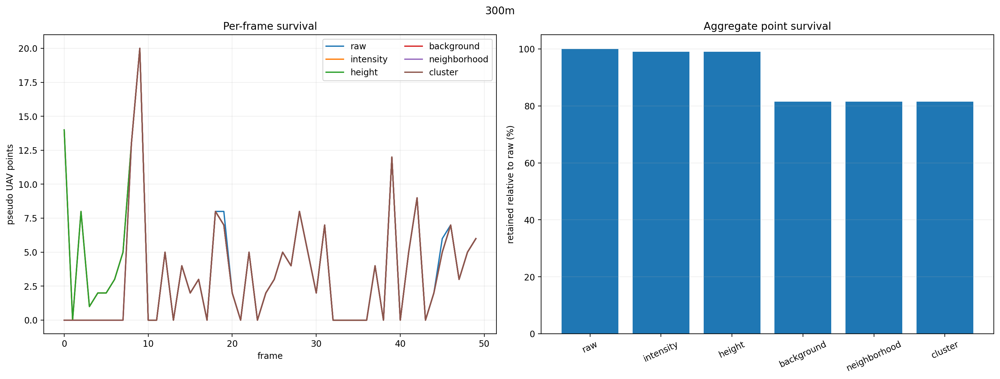

The aggregate background percentages need one important qualification: frames 0–7 are background initialization and intentionally emit no candidates. After initialization:

- cross: 438/443 labeled height-filtered points survive background (98.9%); 419/438 then survive neighborhood (95.7%). Background removes all five target points at frame 30 when the target revisits previously occupied space. Neighborhood removes all target points at frames 28 and 47 and some at frames 29 and 59.
- 300 m: all 163 labeled points after frame 7 survive background, neighborhood, and clustering. Its apparent 81.5% aggregate survival is entirely initialization loss.
- The final DBSCAN configuration uses `min_samples=1`; therefore the cluster stage does not remove any point that survives neighborhood filtering.

For the complete scenes, not just the pseudo labels, the mean per-frame counts are:

| Sequence | Raw | Intensity | Height | Background pre-neighborhood | Final candidates |
|---|---:|---:|---:|---:|---:|
| 100 m | 1,250,000 | 111,512 | 631 | 0.54 | 0.00 |
| 300 m | 1,250,000 | 113,262 | 5,949 | 14.34 | 7.28 |
| cross | 1,250,000 | 253,674 | 7,567 | 48.52 | 20.08 |

The corresponding full-scene curves are [100 m](results/data_archaeology/100m/stage_counts.png), [300 m](results/data_archaeology/300m/stage_counts.png), and [cross](results/data_archaeology/cross/stage_counts.png).

## 4. UAV vs clutter feature comparison

“Nearby clutter” means height-filtered points 3–15 m from the pseudo center and within ±3 m in z. These are local comparison samples, not a universal clutter population.

| Sequence | Feature | Pseudo UAV median [IQR] | Nearby clutter median [IQR] | Evidence |
|---|---|---:|---:|---|
| cross | intensity | 27 [22, 33] | 24 [19, 29] | UAV is only slightly brighter; distributions overlap strongly |
| cross | radial velocity (m/s) | 0.00 [−0.33, 0.21] | −0.11 [−0.11, 0.00] | Strong overlap; tangential flight often has near-zero radial velocity |
| 300 m | intensity | 22.5 [18, 28] | 26 [22, 31] | UAV is weaker than local clutter on median |
| 300 m | radial velocity (m/s) | 0.14 [−0.50, 3.34] | −0.05 [−0.15, 0.00] | Motion helps in some phases, but values near zero remain common |

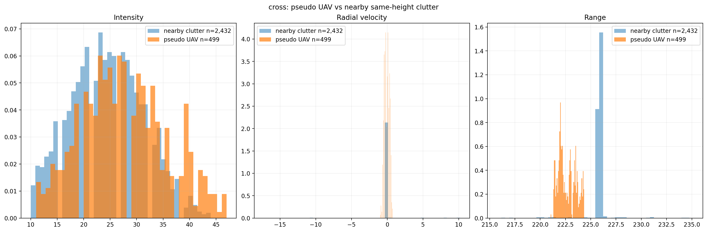

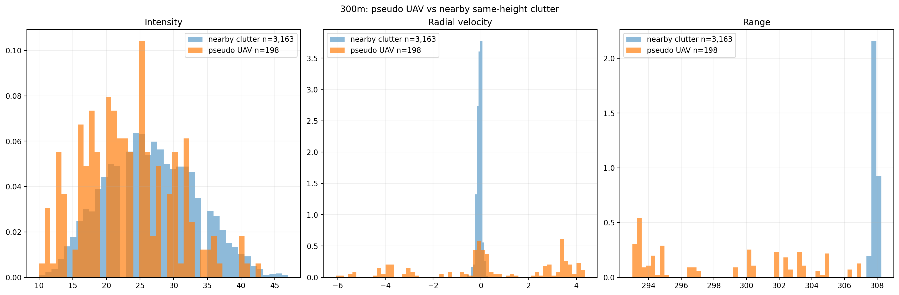

For cross, the point-level radial-velocity range is −0.97 to +0.74 m/s and the median is exactly 0. Across frames, 46.7% have \(|\mathrm{median}(v_r)|\leq0.25\) m/s. For 300 m the point-level range is −6.08 to +4.35 m/s, but 30% of frames still have \(|\mathrm{median}(v_r)|\leq0.25\) m/s. Radial velocity is therefore informative about motion phase, but is not a dependable UAV/clutter separator by itself.

The measured velocity convention is opposite to increasing geometric range. After sign inversion, the framewise median measured velocity correlates with geometric \(dr/dt\) at 0.973 for cross and 0.966 for 300 m. This strongly supports the temporal identity of the tracks and explains the velocity sign, although individual magnitudes do not match perfectly.

## 5. Temporal/trajectory observations

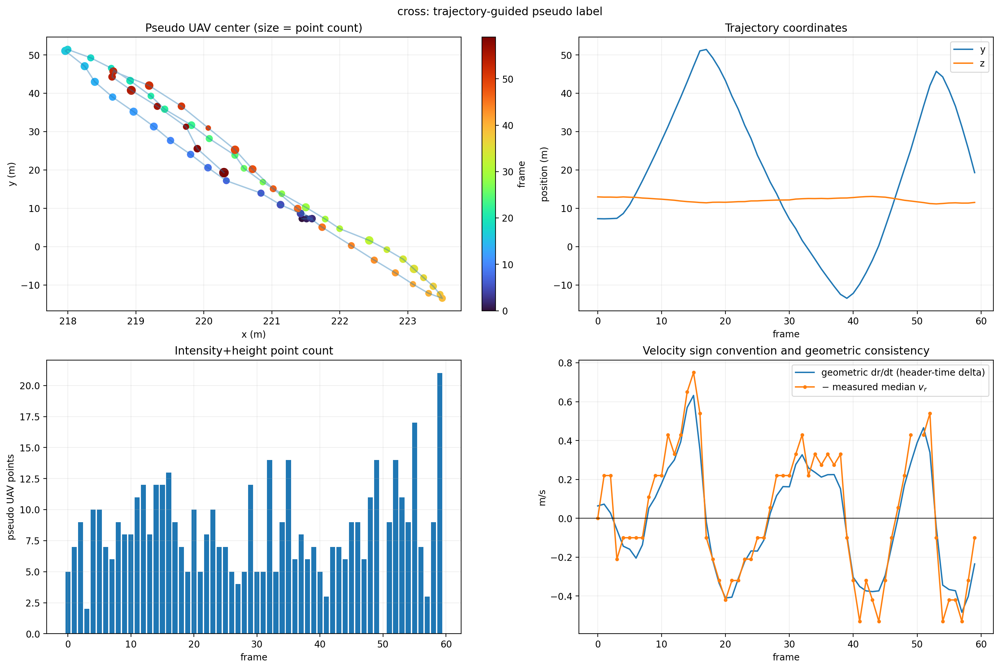

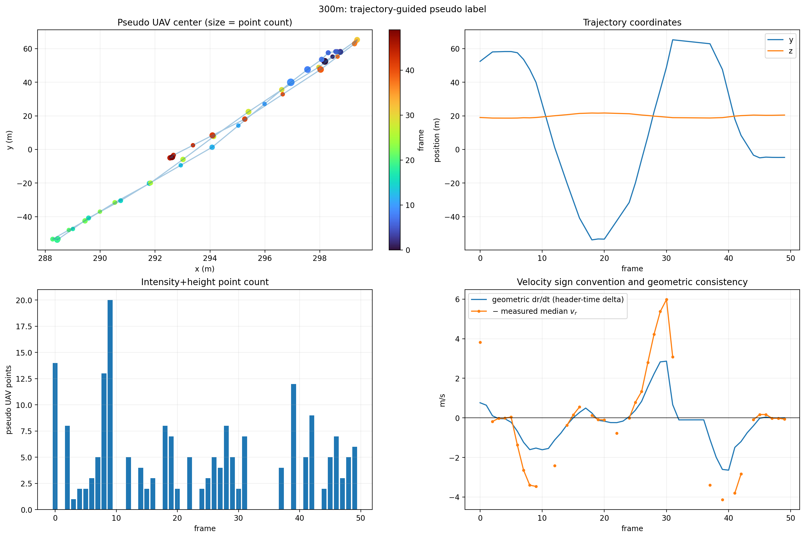

- **Cross:** despite only 2–21 points in most individual frames, 59/60 observed centers form a smooth repeated traverse over all 60 frames. Direction reversals are visible in both y and the sign-inverted radial velocity. This is much more recognizable temporally than in any isolated frame.
- **300 m:** 35/50 frames contain at least one target point and 34 centers are directly observed; interpolation only bridges missing detections. The observed centers form a coherent out-and-back path rather than independent clutter flashes. The temporal path remains recognizable through several two- to five-frame gaps.
- **100 m:** neither height-filtered temporal overlay nor the raw GNSS-consistent search band forms an elevated moving trajectory. The only persistent height-filtered structure is stationary and lies near x≈310 m, not in the expected 100 m band. The [100 m temporal overlay](results/data_archaeology/100m/temporal_overlay.png) should therefore not be read as a UAV track.

Thus the answer to the time-structure question is sequence-dependent: weak single-frame returns do form an obvious continuous structure in cross and 300 m, but no corresponding structure is present in the analyzed 100 m recording.

## 6. 100 m zero-candidate diagnosis

The decisive test was made directly on all 46 raw bag frames, before intensity, height, background, or neighborhood filtering.

- GNSS-derived expected envelope: approximately 105–120 m horizontal range and 6.9–12.8 m relative height.
- Deliberately widened raw search envelope: 90–130 m and z=4–16 m.
- Total raw records searched: 57,500,000.
- Points in the widened expected airspace: **1 point in 46 frames**; intensity 8, radial velocity −2.39 m/s.
- Points surviving intensity [10,250] in that airspace: **0**.
- Comparison band at the same range but z=0–4 m: **9,357 points**, intensity median 31.

Therefore, the current background filter did not delete a recognizable 100 m UAV track: there was effectively no return in the GNSS-consistent airspace before background filtering. The intensity threshold removes the single isolated raw point, but one point across 46 seconds cannot support a UAV trajectory.

The full pipeline still explains why the *remaining scene* ends at zero: intensity leaves about 111k points/frame; z>10 leaves about 631/frame, dominated by a stationary structure; background leaves only 25 points total across all 46 frames (zero in 87% of frames); neighborhood removes all 25. Those points are not in the expected UAV band and must not be counted as UAV.

The most defensible diagnosis is therefore: **missing/uncaptured UAV return or unresolved GNSS–sensor alignment, upstream of background filtering**. It is not possible to distinguish sensor non-return from a recording/pose/extrinsic mismatch with the currently available synchronization evidence.

## 7. Remaining unknowns

1. The GNSS workbook supplies only four 100 m waypoints for this scene. Its timestamps are offset from bag record time by roughly 108 s, and sensor yaw/extrinsics are not available. The range/height envelope is robust to yaw but is not synchronized point-level truth.
2. No synchronized GNSS, optical annotation, or surveyed trajectory was found for the selected 300 m and cross bags. Their compact continuous tracks are strong pseudo labels, not real ground truth.
3. ROS header timestamps are stale/inconsistent with filename and record dates. Their local deltas are usable for motion consistency, but their absolute time cannot be trusted without an external clock mapping.
4. Sensor configuration, target aspect, occlusion, weather, and reflectivity metadata are insufficient to explain why the 100 m return is absent while the 221–307 m tracks are observable.
5. Distance dependence cannot be isolated from flight phase using these three windows. The available tracks cover only narrow, sequence-specific range intervals.

Machine-readable evidence is stored in [`analysis_summary.json`](results/data_archaeology/analysis_summary.json), [`pseudo_label_summary.json`](results/data_archaeology/pseudo_label_summary.json), and the [100 m raw-band result](results/data_archaeology/100m/gnss_expected_band.json).

## 8. Top 3 evidence-based bottlenecks

1. **100 m target evidence is absent before the main preprocessing stages.** Only one sub-threshold raw point exists in a deliberately broad GNSS-consistent airspace across 46 frames. The dominant failure is therefore acquisition/recording/pose alignment, not background suppression of visible UAV points.
2. **Ground-truth synchronization is inadequate.** Without bag-to-GNSS clock mapping and sensor extrinsics, the 100 m absence cannot be separated cleanly into sensor non-return versus coordinate/time mismatch, and the 300 m/cross tracks cannot be promoted beyond pseudo ground truth.
3. **Sparse targets are vulnerable at initialization, path revisits, and neighborhood filtering.** The first eight frames are always suppressed while the background initializes; cross loses a full five-point frame on a revisit and loses isolated target points at four neighborhood-filtered frames. This is a real downstream loss mode, but it is secondary to the upstream absence in 100 m.

## 9. Reverse analysis of the successful original baseline on the cross sequence

### 9.1 Question and evidence boundary

This section starts from the apparently successful top-panel/original method in `scripts/benchmark_fmt.py` on `data/81-pm-cross-x10_2025-11-19-15-57-13_filtered_data` and traces its only final surviving track back to the actual PCD points.

The surviving baseline track is `ID=1`. Its observed centers agree with the independently constructed trajectory-guided pseudo label to a median 3D distance of approximately \(4\times10^{-6}\) m; the maximum discrepancy is 0.251 m. This is strong internal cross-validation that the retained track is the same airborne object analyzed above. It remains **pseudo ground truth**, because no synchronized external UAV position is available.

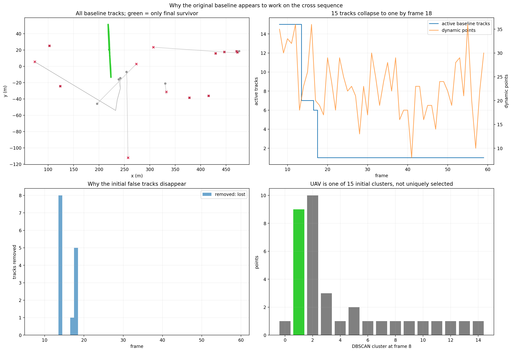

### 9.2 What the baseline actually does

The successful behavior is not a one-frame UAV classifier:

1. The input directory is already intensity-filtered to [10,250] by `multi_filter_with_intensity.py` and transformed into the processing coordinate system.
2. `benchmark_fmt.py` applies z>10 m and the online voxel background/neighborhood filter.
3. At frame 8, 35 dynamic points form 15 DBSCAN clusters. Because `min_points=1`, even a singleton becomes a cluster and a new track. The UAV is merely one of these 15 initial hypotheses; its cluster has 9 points and is not uniquely selected at initialization.
4. By frame 14, eight hypotheses have been removed; by frame 17 another is removed; by frame 18 five more are removed. All 14 false hypotheses are removed because they remain unmatched for more than five frames (`lost_count>5`), not because the static-target counter removes them.
5. `ID=1` is repeatedly re-observed close to its previous position. It is directly associated in 48 of the 52 tracking frames and crosses only four one-frame gaps—frames 28, 30, 47, and 50—using prediction. Its `lost_count` therefore never reaches the removal threshold.

The visual impression that “the background filter very quickly leaves only the UAV” is consequently the combination of two processes: the voxel/neighborhood stage reduces the scene to roughly 8–36 dynamic points per frame, then temporal association removes short-lived candidate tracks over approximately six frames. The tracker, rather than DBSCAN alone, is what turns the sparse candidate set into one surviving object.

### 9.3 What the UAV point cloud looks like

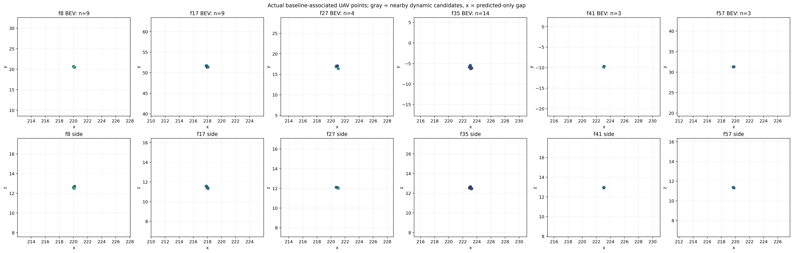

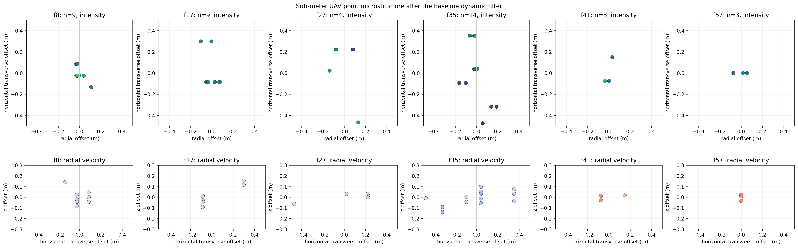

Across the 48 frames with a real association:

| Property | Observed UAV cluster |
|---|---:|
| Points per frame | mean 8.73; median 8.5; range 3–17 |
| Frames with 3–5 points | 9/48 = 18.8% |
| Frames with 6–10 points | 26/48 = 54.2% |
| Frames with >10 points | 13/48 = 27.1% |
| 3D cluster diameter | median 0.394 m; IQR 0.313–0.545 m; max 0.901 m |
| Vertical span | median 0.201 m; IQR 0.141–0.236 m |
| Radial thickness | median 0.150 m |
| Maximum tangential radius | median 0.248 m |
| Intensity | median 27; IQR 22.5–33; range 11–47 |
| Radial velocity | median −0.11 m/s; IQR −0.38–0.32 m/s; range −0.97–0.74 m/s |
| Within-frame radial-velocity IQR | median 0.10 m/s |

This explains the RViz observation. Some frames really contain only three to five points, and all points occupy a sub-meter region, so several symbols overlap in a normal scene-scale view. However, three-to-five-point frames are not the majority; most associated frames contain 6–10 points. The micro-zoom also shows that there is no stable, recognizable UAV silhouette. The point arrangement changes between short lines, small arcs, and disconnected samples as different surfaces/scan rays return energy.

The spatial trajectory is much more stable than the within-frame shape:

- x remains between 217.96 and 223.51 m;
- y traverses −13.49 to +51.43 m and reverses direction several times;
- z remains between 11.13 and 13.08 m;
- total range remains in the narrow interval 221.38–224.27 m;
- the baseline track step has median 3.52 m/frame.

This is predominantly cross-range motion: y changes by about 65 m while total range changes by less than 3 m. Consequently, a genuine moving UAV can have \(v_r\approx0\).

### 9.4 Which properties distinguish it from the remaining dynamic clutter

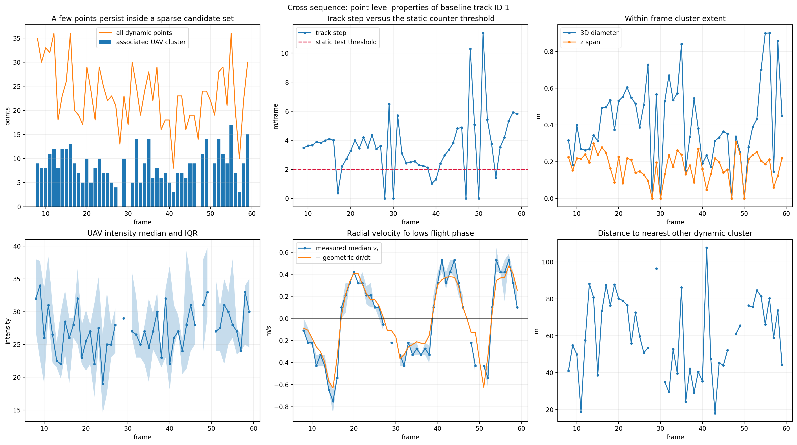

The strongest observed distinction is not a single point attribute. It is the combination of repeated compact clustering, isolation, and coherent motion:

| Evidence | UAV | Other dynamic candidates in the same analyzed frames |
|---|---:|---:|
| Cluster size | median 8.5 points | median 1 point; 75th percentile 1; max 10 |
| Largest cluster in its frame | 46/48 frames = 95.8% | — |
| Fraction of all dynamic points | median 37.2%; range 16.7–58.3% | remainder |
| Distance to nearest other dynamic cluster | median 58.2 m; minimum 17.9 m | — |
| Intensity | median 27 [22.5,33] | median 13 [11,16] |
| Points with intensity >20 | 81.6% | 11.9% |
| Points with \(|v_r|\leq1\) m/s | 100% | 17.8% |

Interpretation:

- **Persistence is the decisive property used by the current baseline.** The UAV cluster is re-observed often enough to keep the same ID; most false candidates are one-frame singletons and expire through `lost_count`.
- **Compact multi-point support is a strong sequence-specific retrospective cue.** The UAV is the largest dynamic cluster in nearly every observed frame, whereas most other dynamic clusters are singletons. The baseline does not explicitly rank clusters by size; this property makes its association unusually easy in this sequence.
- **Spatial isolation reduces association ambiguity.** A median 58 m separation from the next dynamic cluster is large relative to the 30 m association gate.
- **Intensity is informative here but is not used by the baseline tracker.** The benchmark reads intensity, but baseline association uses position and radial-velocity consistency. Moreover, the PCD has already undergone intensity thresholding, so the large UAV-versus-residual difference is conditional on the upstream filters and must be tested on other sequences before generalization.
- **Near-zero radial velocity is a UAV property in this cross flight, not evidence of a static object.** Its usefulness is temporal consistency and sign change with the flight phase. After sign correction, the cluster median radial velocity correlates with geometric \(dr/dt\) at 0.965. Magnitude alone would label these points as visually “static” in the current velocity color map.
- **Within-frame shape is weak evidence.** Diameter and vertical span are compact, but three-to-ten samples do not form a stable shape, and singleton clutter is even more compact. A recognizable geometrical UAV outline should not be expected from this sequence.

### 9.5 Four prediction-only frames

At frames 28, 30, 47, and 50, the displayed baseline track is a prediction rather than an association to surviving points. The current class retains the previous `num_points` and `radial_velocity` values during such a prediction, so a tracker state or GUI label can look like a measured detection even though the current frame contributed no associated cluster. Any later evaluation should distinguish measured and predicted states explicitly.

The reasons for the gaps agree with the earlier survival analysis:

- frame 28: UAV points survive background but are removed by neighborhood filtering;
- frame 30: the revisited UAV voxel is suppressed by background history;
- frame 47: UAV points survive background but are removed by neighborhood filtering;
- frame 50: no point is available in the pseudo-label neighborhood.

The baseline survives because each gap lasts one frame and the next observed cluster lies inside the association gate. This is evidence that short-gap continuity matters more than perfect single-frame recall in this particular result.

### 9.6 Does this reverse analysis help subsequent research?

Yes, for three concrete reasons:

1. It identifies the actual successful signal: not an obvious three-point shape, but a compact cluster that is repeatedly observed, moves coherently in cross range, and remains isolated from transient candidates.
2. It provides an auditable small pseudo-label set for evaluating claims. The result includes frame/timestamp, center, measured/predicted status, associated point count, extent, intensity, radial velocity, cluster rank, and nearest-clutter distance in [`baseline_uav_frames.csv`](results/data_archaeology/cross/baseline_reverse/baseline_uav_frames.csv).
3. It narrows the literature questions without presupposing a new method. The next literature review should ask:
   - how sparse three-to-ten-point targets are characterized when no stable shape exists;
   - how FMCW-LiDAR radial velocity is interpreted for tangential or near-constant-range motion;
   - how temporal persistence is evaluated under one-frame misses and background-model path revisits;
   - how point-level or track-level ground truth is built for small airborne targets.

The key limitation is generalization. This sequence is unusually favorable after preprocessing: the UAV is the largest dynamic cluster in 95.8% of observed frames and is typically tens of metres from the next candidate. The successful baseline result demonstrates that a persistent sparse track is present; it does not yet demonstrate that the same cues separate UAVs from clutter in 100 m, 300 m, or denser scenes.

Machine-readable reverse-analysis results are in [`baseline_reverse_summary.json`](results/data_archaeology/cross/baseline_reverse/baseline_reverse_summary.json). The analysis script is `scripts/reverse_engineer_baseline_uav.py`; it leaves the original benchmark outputs unchanged.

## 10. Reverse analysis of the longitudinal `81-82-pm-x10` success case

The longitudinal result also needs reverse analysis. It is not merely a second visually successful example: together with the cross-flight sequence, it separates motion-invariant UAV evidence from radial-velocity evidence that depends strongly on flight direction. The analysis below exactly replays the first/baseline method in `benchmark_fmt.py` on `81-82-pm-x10_2025-11-19-15-38-07_filtered_data`. As above, the identified target is **trajectory-guided pseudo ground truth**, not externally synchronized ground truth.

### 10.1 Which points form the longitudinal UAV track

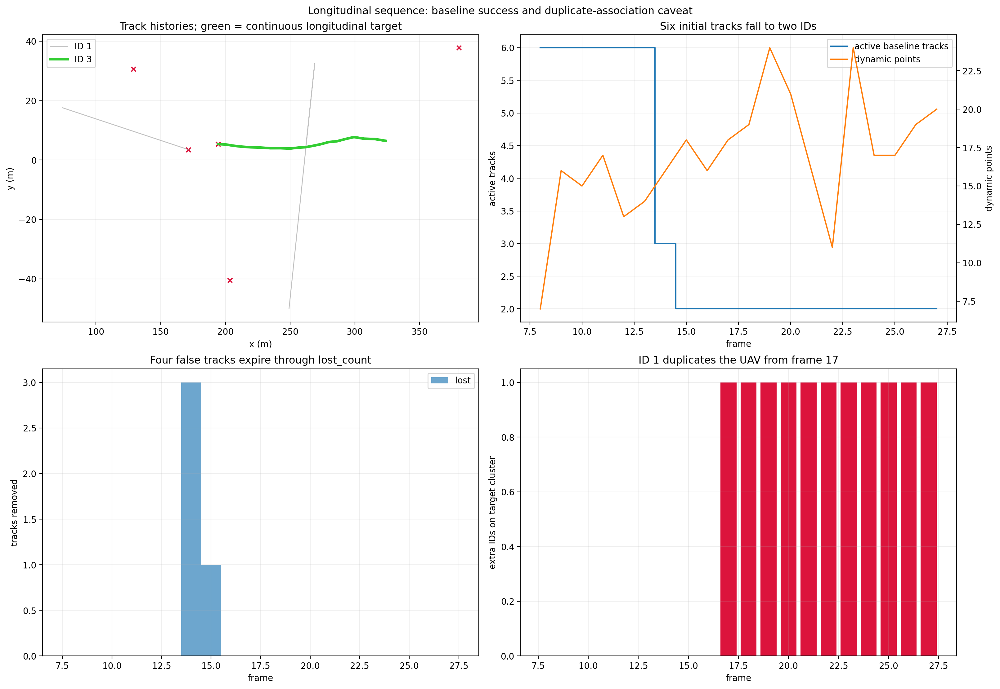

Among the six tracks initialized at frame 8, `ID=3` is the only hypothesis that is directly associated in every frame through frame 27. Its center moves smoothly from approximately `(323.83, 6.45, 13.58)` m to `(194.28, 5.36, 11.10)` m. Range falls monotonically from 324.18 m to 194.67 m while y remains within 3.86–7.73 m. This is consistent with an approaching, predominantly longitudinal flight rather than a stationary object or an isolated false alarm.

The measured radial-velocity sign convention is positive for this approach. Frame-to-frame geometric range change is negative, and `-v_r` correlates with geometric `dr/dt` at 0.984. This agreement in sign-corrected direction and magnitude is strong evidence for the track identity, although it does not replace synchronized ground truth.

### 10.2 What its point cloud looks like

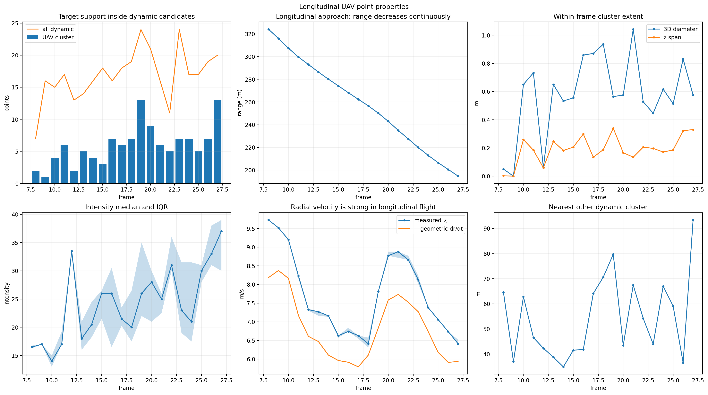

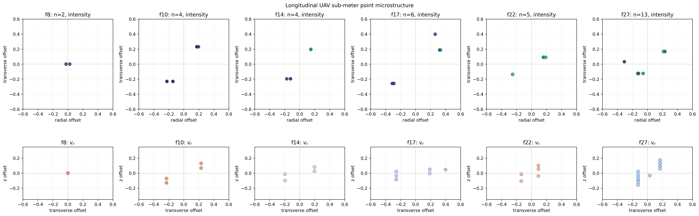

| Property | Longitudinal UAV cluster |
|---|---:|
| Directly observed frames | 20/20, frames 8–27 |
| Points per frame | mean 5.95; median 6; range 1–13 |
| 0 / 1 / 2 point frames | 0% / 5% / 10% |
| 3–5 / 6–10 / >10 point frames | 30% / 45% / 10% |
| 3D cluster diameter | median 0.575 m; IQR 0.524–0.758 m; max 1.043 m |
| Vertical span | median 0.187 m; max 0.339 m |
| Intensity | median 26; IQR 19–32.5; range 10–46 |
| Radial velocity | median 7.38 m/s; IQR 6.74–8.23 m/s; range 6.31–9.73 m/s |
| Within-frame radial-velocity IQR | median 0.065 m/s; max 0.265 m/s |
| Fraction of surviving dynamic points | median 35.5%; range 6.3–65.0% |

This sequence confirms the RViz impression more strongly than the cross flight: one frame contains only one associated UAV point, two frames contain two points, and 45% contain only three to five points. Even when detection is successful, the sensor does not provide a stable UAV silhouette. The observed cluster changes between a singleton and a loose sub-metre group; the reliable evidence lies in its sequence-level continuity rather than a fixed within-frame geometry.

The UAV is the largest dynamic cluster in 18/20 frames. Other dynamic clusters have median size one and maximum size three, while the UAV remains a repeated multi-point cluster in most frames. Its nearest competing cluster is 34.9–93.4 m away (median 50.4 m), so association is usually spatially unambiguous.

Intensity again separates the retrospectively identified UAV from residual candidates: 119 UAV points have median intensity 26, versus 13 for 219 other dynamic points; 68.9% versus 10.0% exceed intensity 20. This is corroborating evidence only. The input PCDs have already been intensity-filtered, and the baseline association itself does not use intensity, so this comparison is conditional on upstream preprocessing.

### 10.3 Why the output becomes clean only in later frames

The baseline does not identify the UAV uniquely at initialization. It creates six tracks at frame 8. Tracks `2`, `4`, and `5` are removed at frame 14 and track `0` at frame 15, all because they have accumulated more than five unmatched frames. Thus, the delayed cleanup is the expected six-frame persistence test: transient clusters must first remain absent long enough to expire. `ID=3` survives because it is measured in every frame, not because a single-frame point-cloud shape immediately reveals a UAV.

There is an important implementation/evaluation caveat. The two final active IDs, `1` and `3`, do **not** represent two physical targets. From frames 17–27, both IDs associate to exactly the same UAV cluster. `benchmark_fmt.py` records used cluster indices but does not exclude them from later track associations. Therefore:

- the visual candidate cloud can be physically clean;
- the tracker can nevertheless count the same object twice;
- the reported final value of two active tracks is an overcount of one physical UAV;
- track-count metrics and displayed predicted/measured states should not be interpreted as object-level ground truth without checking cluster ownership.

This duplicate association does not invalidate the identified UAV points, because `ID=3` has the continuous approach trajectory from frame 8 onward. It does mean that apparent late-frame tracker success is partly inflated at the ID level.

### 10.4 Cross-flight versus longitudinal-flight evidence

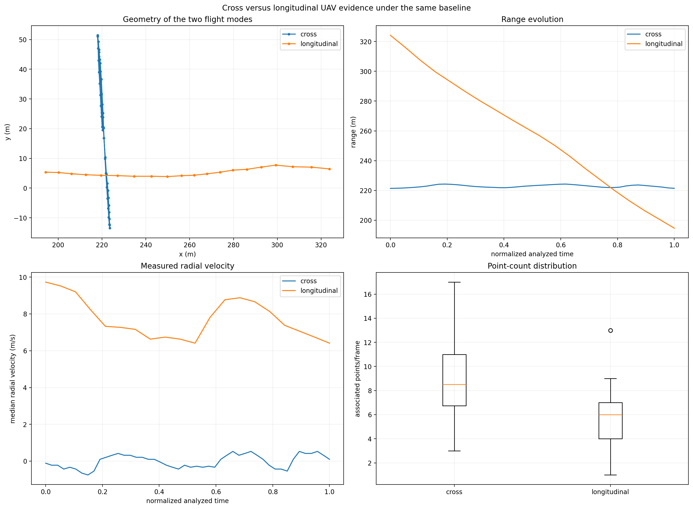

| Evidence | Cross flight (`81-pm-cross`) | Longitudinal flight (`81-82-pm`) |
|---|---:|---:|
| Direct observations | 48/52 tracking frames | 20/20 tracking frames |
| UAV points/frame | median 8.5; range 3–17 | median 6; range 1–13 |
| 3D diameter | median 0.394 m | median 0.575 m |
| Intensity | median 27 | median 26 |
| Radial velocity | median −0.11 m/s | median +7.38 m/s |
| Total observed range interval | 221.38–224.27 m | 194.67–324.18 m |
| UAV is largest dynamic cluster | 95.8% of observed frames | 90.0% of frames |
| Nearest other cluster | median 58.2 m | median 50.4 m |
| Velocity/geometric-range correlation | 0.965 after sign correction | 0.984 after sign correction |

The comparison yields three evidence-based conclusions:

1. **Compactness, persistence, and spatial isolation transfer across the two successful motion modes.** In both, the UAV is sparse and shape-unstable, but it repeatedly forms the dominant surviving cluster and follows a coherent trajectory far from transient candidates.
2. **Radial-velocity magnitude does not transfer as a universal UAV discriminator.** The cross-flight UAV stays near `v_r=0`, while every longitudinal frame has a median `|v_r|>1` m/s and the longitudinal point-level range is 6.31–9.73 m/s. A magnitude rule that favors one motion mode would suppress the other. What is consistent in both sequences is agreement between radial velocity and the temporal change of range.
3. **Point count is useful as supporting evidence, not a minimum-return rule.** The longitudinal UAV is successfully tracked through a one-point frame and two two-point frames, whereas most residual clutter clusters are also singletons. Point count becomes informative only together with repeated position/velocity continuity.

This reverse comparison is therefore useful for the next literature search: it establishes that the phenomenon to explain is a sparse, intermittently shaped but temporally coherent target under two very different Doppler regimes. It also prevents treating the favorable near-zero velocity in the cross sequence—or the strong approach velocity in the longitudinal sequence—as an intrinsic UAV signature.

Frame-level measurements, including center, point count, extent, intensity, velocity, competing-cluster distance, and duplicate-ID flags, are in [`longitudinal_uav_frames.csv`](results/data_archaeology/longitudinal/baseline_reverse/longitudinal_uav_frames.csv). The machine-readable summary is [`longitudinal_reverse_summary.json`](results/data_archaeology/longitudinal/baseline_reverse/longitudinal_reverse_summary.json). The reproducible analysis script is `scripts/reverse_engineer_longitudinal_baseline.py`; it does not modify the source PCDs or benchmark outputs.
