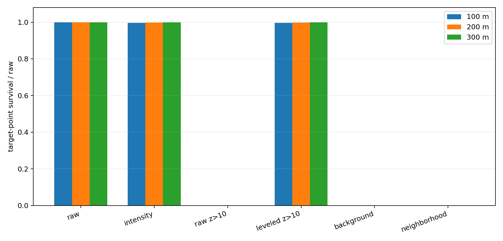
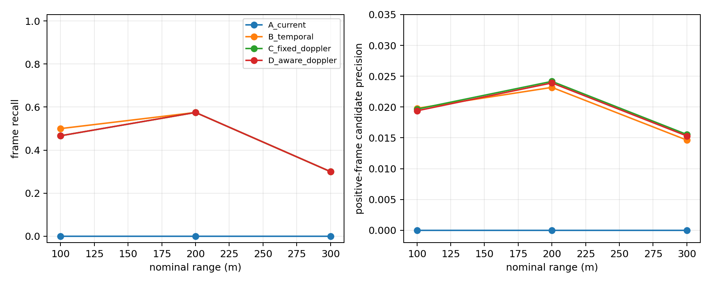
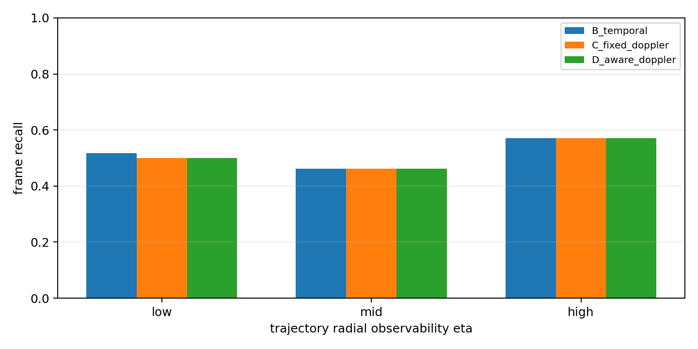

# FMCW Sparse-UAV MVP — frozen `research_dev_v0`

**Run date:** 2026-09-22  
**Status:** **TESTED / VERIFIED RESULT on DEV silver labels; not final paper ground truth**  
**Scope:** detection-layer research only. No Grassmann/manifold model, deep network, JPDA, or baseline source modification was performed.

## 1. Executive conclusion

Five cross-flight LiDAR trajectories that passed the calibration-closure study were frozen as `research_dev_v0`: 80 observed LiDAR evidence frames across 100/200/300 m. The labels are **DEV/silver labels**, derived from LiDAR trajectories and closure selection, so they are useful for method development but unsuitable for final headline accuracy.

The strongest result is a preprocessing diagnosis. Of 1,883 raw points within 3 m of the silver centers, intensity 10–250 retains 1,877 (99.68%). The original LiDAR-frame `z>10` retains **0/1,877**. Applying the same threshold after the provisional 6-DoF gravity alignment retains **1,877/1,877**. Thus the original height test is expressed in the wrong coordinate frame for these February sequences.

The Khosravi-style spatial/temporal detector recovers 41/80 silver frames (51.25%), versus 0/80 for the current preprocessing baseline. This does **not** establish that temporal consistency is the cause: removing M-of-K increases recall from 51.25% to 61.25% with essentially unchanged candidate precision. The gain over the current baseline is dominated by corrected coordinate handling and broader candidate generation.

FMCW Doppler gives no verified independent gain in this DEV experiment. Fixed Doppler gating reduces false candidates from 1,914 to 1,817 but loses one true frame; observability-aware weighting retains the same 40/80 frames and 1,840 false candidates. The low/mid/high observability strata are highly imbalanced (60/13/7 frames), and fixed versus aware weighting has identical stratum recall.

At 300 m, the target has median 5 raw points and 1.5 occupied 1 m voxels per silver frame. `minPts=1` reaches 90% recall but only 1.76% positive-frame candidate precision; `minPts=2` falls to 30% recall and `minPts=3` to zero. This is direct evidence of a detect-then-cluster bottleneck and is sufficient to motivate a controlled Track-Before-Detect study, but not evidence that TBD will succeed.

## 2. Original processing chain recovered

The user-described chain is confirmed in source:

1. `get_lidar.py` extracts `x`, `y`, `z`, `intensity`, and `velocity` by field name into a reduced PointCloud2 stream.
2. `multi_filter_with_intensity.py` transforms rich-packet sensor coordinates as `[x,z,-y]` and retains intensity in `[10,250]`, producing filtered PCD files.
3. `visualize_pcd.py --mode velocity` colors points by measured velocity for manual moving-point inspection.

Benchmark v0 subsequently added raw LiDAR `z>10`, occupancy background filtering, a 27-voxel neighborhood filter, and DBSCAN. The height stage, not the original intensity stage, is the first total-loss stage for the frozen silver targets.

## 3. Frozen DEV set and anti-circularity controls

| Condition | Frozen closure candidate | Silver frames | Closure role |
|---|---:|---:|---|
| `100m_cross_5` | `100m_cross_5_e0001` | 19 | calibration |
| `100m_cross_10` | `100m_cross_10_e0003` | 11 | held-out validation |
| `200m_cross_5` | `200m_cross_5_e0003` | 22 | calibration |
| `200m_cross_10` | `200m_cross_10_e0001` | 18 | held-out validation |
| `300m_cross_10` | `300m_cross_10_e0003` | 10 | held-out validation |

Controls:

- candidate IDs and all 80 center labels were frozen before the formal comparison;
- labels contain observed evidence frames only; no missing frame was interpolated;
- no method output was used to move, add, or delete a label;
- `300m_cross_5` was excluded because its LiDAR trajectory did not pass GNSS closure;
- labels are explicitly marked `DEV_SILVER` and `paper_ground_truth=False`;
- the uncorrected broad-ROI pilot is retained under `results/research_dev_v0/pilot_uncorrected_roi/` rather than discarded.

The input-protocol addendum applies the legacy 10 m height threshold after the already-estimated provisional 6-DoF rotation. It was frozen before the formal rerun. This is a coordinate correction, not a threshold sweep. Because that rotation and the silver labels share calibration-closure provenance, final test evaluation still requires independent GT.

## 4. Methods

### A — Current rules baseline

The exact existing stages are used through intensity → raw `z>10` → occupancy background → neighborhood → DBSCAN (`eps=2`, `minPts=1`). Candidate linking uses bag timestamps. This is a detection-layer wrapper, not a claim that the legacy tracker was rewritten or fixed.

### B — Khosravi-style temporal detector without Doppler

- broad ROI: x 8–510 m, y ±200 m, raw z ±60 m;
- provisional 6-DoF gravity alignment followed by height >10 m;
- existing auditable 1 m raw-voxel cache;
- range-adaptive DBSCAN, `eps=0.8 + 0.004 max(r_mean-10,0)`, capped at 2.5 m;
- default `minPts=2`;
- at most 32 voxels, 120 raw returns, and 6 m extent per cluster;
- real bag `Δt`, maximum speed 25 m/s, minimum jump allowance 3 m;
- M=2 of K=3 temporal confirmation;
- component-wise weighted median center when raw support is at least three points.

This is a project adaptation of the detector structure described by [Khosravi, Ventura, and Basiri (2026)](https://arxiv.org/abs/2603.11586), not an exact parameter reproduction. Their paper does not provide every validation threshold, and their 10–25 m airborne Livox setting differs materially from this 100–300 m ground-sensor FMCW setting.

### C and D — Doppler variants

For both variants, predicted Cartesian velocity is projected onto the current line of sight. Dataset evidence requires comparing it to the sign-corrected value `-measured_velocity`.

- C rejects an association when the absolute residual exceeds 4 m/s.
- D uses `eta = |e_r^T v|/(||v||+eps)` and rejects only when `eta × residual > 4 m/s`.

No Doppler threshold or label was retuned after results were visible.

## 5. Preprocessing survival

| Range | Silver frames | Raw target points | Intensity | Raw `z>10` | Leveled `z>10` | Background | Neighborhood/DBSCAN |
|---:|---:|---:|---:|---:|---:|---:|---:|
| 100 m | 30 | 1,126 | 1,122 | 0 | 1,122 | 0 | 0 |
| 200 m | 40 | 691 | 689 | 0 | 689 | 0 | 0 |
| 300 m | 10 | 66 | 66 | 0 | 66 | 0 | 0 |
| **Total** | **80** | **1,883** | **1,877** | **0** | **1,877** | **0** | **0** |

The background and later columns are zero because the original pipeline receives zero target points after raw `z>10`; they do not independently prove that background/neighborhood would remove the target after a corrected height transform.

Raw target sparsity by range:

| Range | Median raw points/frame | Evidence voxel median | Raw point-count bins `0/1/2/3–5/6–10/>10` |
|---:|---:|---:|---|
| 100 m | 39.5 | 2.0 | 0 / 0 / 0 / 0 / 1 / 29 |
| 200 m | 17.5 | 2.0 | 0 / 0 / 0 / 1 / 9 / 30 |
| 300 m | 5.0 | 1.5 | 0 / 1 / 0 / 5 / 1 / 3 |



## 6. Formal A–D results

Metrics are computed only on frozen positive silver frames. “Precision” is therefore matched candidates divided by all candidates on those positive frames; it is **not** operational dataset precision because negative frames/scenes are not labeled.

| Method | Overall recall | Candidate precision | False candidates | Mean matched-center error | All-frame output candidates | Runtime* |
|---|---:|---:|---:|---:|---:|---:|
| A current | 0.000 | 0.000 | 12 | — | 93 | 0.036 s |
| B temporal, no Doppler | 0.5125 | 0.02097 | 1,914 | 0.161 m | 6,496 | 1.171 s |
| C fixed Doppler | 0.5000 | 0.02154 | 1,817 | 0.161 m | 6,162 | 1.206 s |
| D observability-aware | 0.5000 | 0.02128 | 1,840 | 0.161 m | 6,240 | 1.173 s |

\* Runtime uses cached voxels and excludes raw bag I/O/cache construction. A processes the much smaller legacy post-neighborhood input, so its runtime is not a like-for-like throughput comparison.

Per nominal range:

| Method | 100 m recall / precision | 200 m recall / precision | 300 m recall / precision |
|---|---:|---:|---:|
| A | 0 / — | 0 / 0 | 0 / — |
| B | 0.500 / 0.0198 | 0.575 / 0.0232 | 0.300 / 0.0146 |
| C | 0.467 / 0.0197 | 0.575 / 0.0242 | 0.300 / 0.0155 |
| D | 0.467 / 0.0194 | 0.575 / 0.0239 | 0.300 / 0.0153 |

B track coverage for the best single ID is 0.263/0.636 on the two 100 m sequences, 0.273/0.611 on the two 200 m sequences, and 0.300 at 300 m. The corresponding longest runs of missed silver observations are 4/3, 8/3, and 4. These are gaps in the ordered silver observations, not necessarily every intervening LiDAR frame.

Matched-center errors are artificially favorable because labels and candidates both originate from the same 1 m voxel representation. They measure self-consistency, not independent localization accuracy.



## 7. Required ablations

Overall results on 80 silver frames:

| Ablation | Recall | Candidate precision | False candidates | Interpretation |
|---|---:|---:|---:|---|
| `minPts=1`, adaptive, temporal | 0.9625 | 0.01764 | 4,288 | high recall, severe candidate flood |
| `minPts=2`, adaptive, temporal | 0.5125 | 0.02097 | 1,914 | frozen B |
| `minPts=3`, adaptive, temporal | 0.1375 | 0.01145 | 950 | sparse targets largely lost |
| `minPts=2`, fixed eps, temporal | 0.5000 | 0.02141 | 1,828 | no meaningful adaptive-eps advantage |
| `minPts=2`, adaptive, no temporal | 0.6125 | 0.02099 | 2,285 | more recall; similar precision |
| fixed Doppler | 0.5000 | 0.02154 | 1,817 | small FP reduction, one TP lost |
| observability-aware Doppler | 0.5000 | 0.02128 | 1,840 | no advantage over fixed gate |

At 300 m specifically:

- `minPts=1/2/3` recall is 0.90 / 0.30 / 0.00;
- disabling temporal consistency raises `minPts=2` recall from 0.30 to 0.50;
- adaptive versus fixed DBSCAN both give 0.30 recall;
- B/C/D all detect 3/10 silver frames.

## 8. Doppler observability

| Trajectory eta band | Frames | B recall | C recall | D recall |
|---|---:|---:|---:|---:|
| `<0.25` | 60 | 0.5167 | 0.5000 | 0.5000 |
| `0.25–0.60` | 13 | 0.4615 | 0.4615 | 0.4615 |
| `>=0.60` | 7 | 0.5714 | 0.5714 | 0.5714 |

The cross-flight-only DEV set is dominated by low radial observability. C and D have identical recall in every eta band. Seven high-observability frames are too few to test an observability-dependent gain reliably.



## 9. Answers to the research questions

### A. Does Khosravi-style temporal consistency clearly beat the current rules baseline?

**Pipeline B beats A in recall (51.25% versus 0%), but the gain cannot be attributed to temporal consistency.** A deletes all target points at raw `z>10`. Within B, M-of-K reduces recall from 61.25% to 51.25% and leaves candidate precision essentially unchanged. The current evidence supports corrected coordinates and permissive sparse candidate generation, not a claimed temporal-consistency improvement.

### B. Does FMCW Doppler add value independent of spatial temporal consistency?

**No verified independent gain.** Fixed gating removes 97 false candidates (5.1%) but also one of 41 detected target frames. Observability-aware gating removes 74 false candidates and loses the same frame. This is at most a weak false-candidate trade-off, not a detection gain.

### C. Does Doppler gain change with radial/cross-range observability?

**UNKNOWN / not supported by this DEV set.** Fixed and aware methods have identical recall within all three eta bands. The set contains only seven high-eta frames, so absence of an observed effect is not evidence of no physical effect.

### D. Is 300 m sparse enough to justify Track-Before-Detect research?

**Yes as a next hypothesis, not as a demonstrated solution.** The sharp `minPts` collapse, 1.5 median target voxels, 30% B recall, and severe singleton false-candidate trade-off identify per-frame clustering as a bottleneck. A future TBD experiment must use frozen independent labels and negative scenes and must report false alarms, not only recovered tracks.

## 10. Limitations

1. Labels are selected LiDAR trajectories, not independent truth. Selection and evaluation share a voxel representation.
2. Only target-positive evidence frames are labeled; operational precision, false alarms per second, and true negative rate are UNKNOWN.
3. The provisional 6-DoF rotation is reused for leveled height filtering and is not a surveyed extrinsic.
4. The 1 m cache stores voxel-mean intensity; detector input is therefore not identical to raw-point intensity filtering followed by a 0.04–0.07 m voxel grid in the reference paper.
5. The Khosravi-style thresholds are project-specific frozen choices because not all paper parameters are available and the sensing geometry differs.
6. No longitudinal or roundtrip sequence passed the inclusion rule, limiting the Doppler observability range.
7. No JPDA or new tracking model was implemented, by design.

## 11. Reproduction and artifacts

Environment: Python 3.10, NumPy 2.2.6, SciPy 1.15.3, scikit-learn 1.7.2. `scikit-learn` was restored after the reboot because the repository's existing analysis scripts require it.

```bash
python3 scripts/sparse_uav_mvp.py freeze
python3 scripts/sparse_uav_mvp.py audit
python3 scripts/sparse_uav_mvp.py benchmark
python3 -m pytest -q tests/test_sparse_uav_mvp.py
```

Immutable identities:

- Git snapshot containing the tested script/tests: `e62848f787dcfd1bb2f91536ca23e6a50580a77b`; report/docs were still uncommitted at handoff;
- script SHA-256: `2ff01d1b0e3906968b99886c4c793fe3e84c5628d78c3a99e3f9cf0a2bd3d3dc`
- labels SHA-256: `37c4452a68e544d75034389f82bbaf1e868903bb2225b395b9d66d0cdd48b8db`
- protocol SHA-256: `b8575fc94efa1b33624a0ac92f1e464c2e58e1955817ff125c7154d176490b67`
- input addendum SHA-256: `2edf3d49dae537fe4b8df1ea8065944bcf0941c4b186a090d9cf09fdefb0f9ee`

Machine-readable outputs are under `results/research_dev_v0/`:

- `dev_manifest.csv`, `silver_labels.csv`;
- `protocol.json`, `input_protocol_addendum.json`, `run_manifest.json`;
- `stage_survival.csv`;
- `benchmark_results.csv`, `frame_results.csv`, `ablation_results.csv`;
- `observability_frames.csv`, `observability_summary.csv`;
- `figures/*.png`;
- `pilot_uncorrected_roi/` for the preserved pre-addendum pilot.
