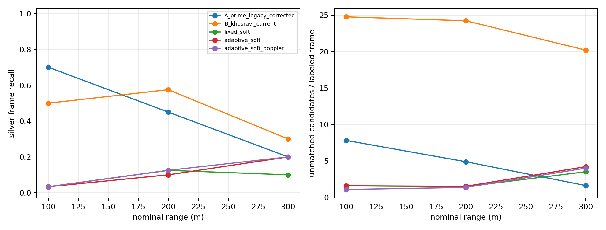
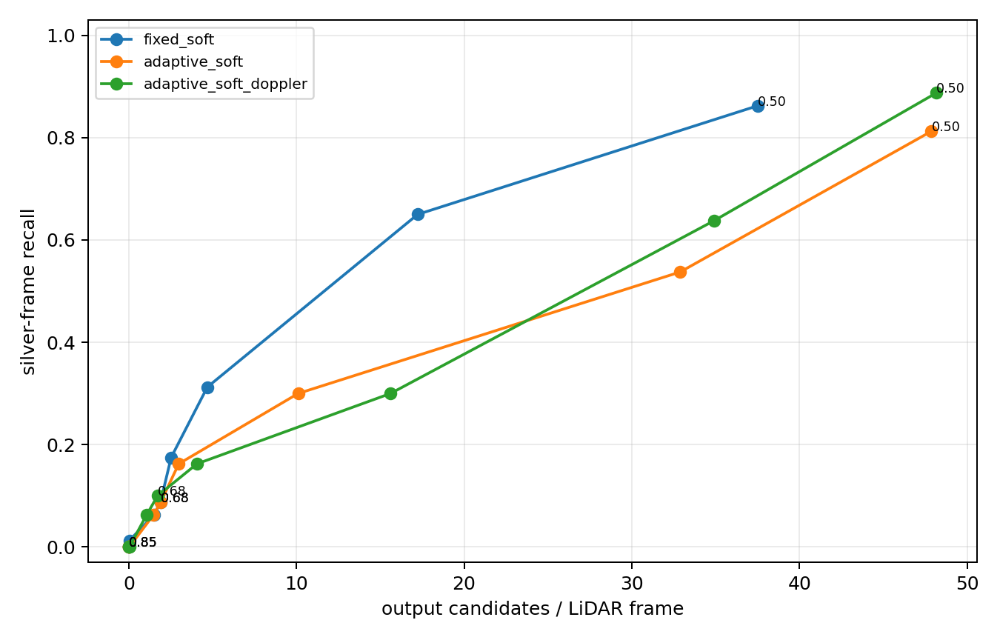

# FMCW Temporal-Evidence MVP — frozen `research_dev_v0`

**Run date:** 2026-09-29  
**Status:** **TESTED / VERIFIED RESULT on DEV silver labels; not final paper ground truth**  
**Scope:** lightweight pre-track temporal evidence only. Historical baselines were not edited; no complete DP-TBD, deep network, Grassmann/manifold method, or new tracker was implemented.

## Material Passport

- **Artifact type:** experiment result and method-development report.
- **Verification status:** repository-backed, locally reproduced, and checked against machine-readable outputs.
- **Label status:** `DEV_SILVER`; LiDAR-derived and selection-conditioned, not independent GT.
- **Primary inputs:** five frozen cross-flight sequences and 80 observed silver frames in `research_dev_v0`.
- **Primary outputs:** `results/temporal_evidence_mvp/`.
- **Permitted claim:** diagnostic evidence about the recall/candidate-volume trade-off on this frozen development set.
- **Prohibited claim:** operational precision, false-alarm rate, final localization accuracy, or paper-test performance.

## 1. Executive result

The experiment did **not** validate the frozen soft accumulator as a solution to the `minPts=1` recall–clutter problem. The singleton-capable input detects 80/80 silver observations, but produces 62.48 candidates per LiDAR frame. At the prospectively frozen score threshold of 0.68, fixed/adaptive/adaptive+Doppler accumulation retain only 7/7/8 of 80 observations. Candidate volume falls to approximately 1.7–1.9 per LiDAR frame, but the recall loss is unacceptable.

A predeclared diagnostic threshold sweep reveals a narrower, hypothesis-generating result. At threshold 0.55, fixed-window accumulation reaches 52/80 recall (65.0%) with 17.23 outputs per LiDAR frame. This is better on both quantities than current Khosravi-style B at 41/80 (51.25%) and 23.88 outputs per frame. It is **not** a validated operating point: the threshold is observed on the same DEV set, reliable negative windows do not exist, and no held-out sequence was used to select it.

The simple adaptive window is not better overall. It tends to preserve far/sparse clutter as well as target evidence. At threshold 0.55 it yields 43/80 recall and 32.89 outputs per frame, versus fixed-window 52/80 and 17.23. It helps 300 m recall, but at a large candidate-volume cost.

Soft Doppler changes candidate ranking and crosses one additional silver frame at the formal threshold, but it has no consistent Pareto advantage. At threshold 0.55 it reaches 51/80, one fewer than fixed-window, while emitting about twice as many candidates per frame. Independent Doppler value therefore remains **not supported**.

## 2. Frozen question and controls

The falsifiable question was whether singletons and very small clusters can be retained initially, then suppressed by multi-frame soft evidence without recreating the severe clutter of `minPts=1`.

Controls were frozen before comparison:

- labels are the unchanged 80 observations in `results/research_dev_v0/silver_labels.csv`;
- candidate generation uses `minPts=1`, the existing range-adaptive DBSCAN, and existing geometry validation;
- bag timestamps provide the actual inter-frame `dt`;
- the score is `0.45 persistence + 0.35 motion consistency + 0.20 compactness`;
- the formal acceptance threshold is 0.68;
- the fixed window is 4 s;
- the adaptive window is 6 s for range >=250 m or raw support <=5, 3 s for raw support >=20 or speed >=8 m/s, and 4 s otherwise;
- Doppler is an optional bounded score adjustment, never a hard gate;
- diagnostic thresholds 0.50–0.85 were declared in `protocol.json` before execution;
- no labels were moved, added, or deleted after observing results.

There is no hard M-of-K rule. Paths are connected greedily through predicted position, real `dt`, a 25 m/s maximum speed, and a soft penalty for changes in implied Cartesian velocity. Persistence is time-decayed; compactness is `exp(-extent/2 m)`.

For Doppler, expected radial speed is the implied Cartesian velocity projected onto line of sight. Dataset evidence requires comparing it with `-measured radial velocity`. The residual contributes

`0.15 * eta * (exp(-residual/4 m/s) - 0.5)`,

where `eta` is radial observability. Thus inconsistent Doppler may lower a score but never deletes a candidate or path directly.

## 3. Fair corrected legacy baseline A′

A′ does not read the historical post-background/neighborhood candidate cache. It starts from the calibration-closure **pre-stage 1 m raw-voxel artifact**, transforms voxel centroids into provisional yaw-preserving leveled coordinates,

`q = Rz(yaw_full) R_full^T (p_lidar - t_full)`,

then reruns intensity, leveled `z>10`, legacy occupancy background, 27-neighborhood filtering, and DBSCAN (`eps=2 m`, `minPts=1`). Candidate centers are transformed back to LiDAR coordinates for evaluation.

This is the fairest reproducible corrected legacy baseline available without rereading 115 GB of bags, but it is not bit-identical to raw-point legacy processing: intensity is a 1 m voxel mean and geometry uses voxel centroids. That approximation is explicitly retained as a limitation.

Target-neighborhood raw support through A′ is:

| Nominal range | Input support / frames | After background | After neighborhood / DBSCAN |
|---:|---:|---:|---:|
| 100 m | 1,126 / 30 | 1,051 / 29 | 755 / 21 |
| 200 m | 691 / 40 | 434 / 25 | 258 / 18 |
| 300 m | 66 / 10 | 19 / 2 | 19 / 2 |
| **Total** | **1,883 / 80** | **1,504 / 56** | **1,032 / 41** |

Sixteen silver observations occur in the first eight frames of their respective bags: eight in `200m_cross_5` and eight in `300m_cross_10`. Legacy initialization emits no dynamic candidates there. Further losses occur through background absorption and the neighborhood filter.

## 4. Formal comparison at frozen threshold

“Unmatched candidates/labeled frame” counts outputs outside the 3 m silver match radius on the 80 labeled positive frames. “Outputs/LiDAR frame” includes all frames, but is **not** a false-alarm rate because unlabeled frames are not verified target-absent.

| Method | Recall | Unmatched candidates / labeled frame | Outputs / LiDAR frame | Reduction from singleton input |
|---|---:|---:|---:|---:|
| A′ legacy corrected | 41/80 = 0.5125 | 5.56 | 5.98 | n/a |
| B current Khosravi-style | 41/80 = 0.5125 | 23.93 | 23.88 | 15.7% from its `minPts=2` input |
| Fixed-window soft, threshold 0.68 | 7/80 = 0.0875 | 1.75 | 1.89 | 97.0% |
| Adaptive-window soft, threshold 0.68 | 7/80 = 0.0875 | 1.86 | 1.90 | 97.0% |
| Adaptive-window + Doppler, threshold 0.68 | 8/80 = 0.1000 | 1.57 | 1.72 | 97.3% |
| `minPts=1` unaccumulated diagnostic | 80/80 = 1.0000 | 62.41 | 62.48 | 0% |

A′ and B have identical overall recall, but A′ emits about four times fewer candidates. Their range behavior differs, so this is not method equivalence: A′ is stronger at 100 m and weaker at 200/300 m.

### 4.1 Per-range formal results

Each cell is `recall; unmatched/labeled frame; outputs/LiDAR frame`.

| Method | 100 m | 200 m | 300 m |
|---|---:|---:|---:|
| A′ legacy corrected | 0.700; 7.80; 6.62 | 0.450; 4.88; 6.11 | 0.200; 1.60; 4.94 |
| B current | 0.500; 24.77; 23.50 | 0.575; 24.23; 24.15 | 0.300; 20.20; 23.81 |
| Fixed soft | 0.033; 1.57; 1.96 | 0.125; 1.45; 1.82 | 0.100; 3.50; 1.95 |
| Adaptive soft | 0.033; 1.57; 1.74 | 0.100; 1.50; 1.89 | 0.200; 4.20; 2.13 |
| Adaptive + Doppler | 0.033; 1.07; 1.49 | 0.125; 1.35; 1.69 | 0.200; 4.00; 2.08 |

The adaptive rule doubles formal 300 m recall from 1/10 to 2/10, but does not improve overall recall and increases the 300 m unmatched-candidate burden. This is not evidence of a generally better temporal window.



## 5. Predeclared diagnostic score sweep

The sweep is a recall-versus-candidate-volume curve, **not a PR curve**. Precision and false alarms require reliable negative windows, which are unavailable.

| Method / threshold | Recall | Unmatched / labeled frame | Outputs / LiDAR frame |
|---|---:|---:|---:|
| Fixed / 0.50 | 69/80 = 0.8625 | 36.30 | 37.52 |
| Adaptive / 0.50 | 65/80 = 0.8125 | 47.71 | 47.87 |
| Adaptive + Doppler / 0.50 | 71/80 = 0.8875 | 47.83 | 48.17 |
| Fixed / 0.55 | 52/80 = 0.6500 | 16.71 | 17.23 |
| Adaptive / 0.55 | 43/80 = 0.5375 | 32.29 | 32.89 |
| Adaptive + Doppler / 0.55 | 51/80 = 0.6375 | 34.06 | 34.90 |
| Fixed / 0.60 | 25/80 = 0.3125 | 4.46 | 4.69 |
| Adaptive / 0.60 | 24/80 = 0.3000 | 9.57 | 10.11 |
| Adaptive + Doppler / 0.60 | 24/80 = 0.3000 | 15.22 | 15.61 |

Fixed-window threshold 0.55 is the only observed soft operating point that dominates B on both silver recall and output count. It was part of the predeclared sweep, so it is a legitimate diagnostic observation; selecting it now as the method default would nevertheless be post-result tuning. It remains a candidate for a **future independently validated** protocol, not the result of this frozen formal comparison.

It is also not a pure demonstration of temporal accumulation. A maximally compact candidate on its first observation receives approximately `0.552` from the frozen persistence/motion/compactness formula, so threshold 0.55 can admit some new compact candidates without multi-frame history. This is permitted by the intended no-hard-M-of-K design, but means the apparent operating point combines single-frame compactness with temporal evidence and must not be attributed to persistence alone.

At threshold 0.50, high recall is partly retained, but candidate volume remains severe. The reduction from 62.48 raw singleton candidates/frame to 37.52 for fixed-window accumulation is real, yet 36.30 unmatched candidates per labeled frame is not an operational solution.



## 6. Why no false-alarms/frame or PR curve is reported

All five included bags are UAV-flight bags. Silver labels contain observed LiDAR evidence only; they do not label continuous target presence or absence. A frame outside a silver fragment may contain an unselected weak target return. Treating every such frame as negative would make real but unlabeled UAV candidates into false alarms.

Therefore:

- false alarms per verified negative frame: **UNKNOWN**;
- operational precision: **UNKNOWN**;
- PR curve: **not constructed**;
- reported substitutes: unmatched candidates on labeled positive frames, all outputs per LiDAR frame, and a recall–candidate-volume curve.

This decision is recorded in `negative_window_audit.json` and was frozen before the run.

## 7. Answers to the research questions

### A. Can `minPts=1` recall be retained while candidate volume is strongly reduced?

**Not at the frozen formal operating point.** The input reaches 100% silver recall, whereas the three formal soft variants retain only 8.75–10%. At diagnostic threshold 0.50, 81.25–88.75% recall remains, but 37.5–48.2 outputs per frame remain. Fixed threshold 0.55 is promising relative to B, but it is a DEV observation requiring independent negative scenes and held-out validation.

### B. Is the adaptive temporal window better than the fixed window?

**No overall.** Fixed-window accumulation has the better recall–candidate curve across most predeclared thresholds. The adaptive rule helps the 300 m subset, but also preserves large amounts of sparse/far clutter and performs worse overall. The current range/support heuristic is therefore not accepted as an improvement.

### C. Is Doppler more valuable as soft evidence than as a hard gate?

**Not established.** Soft Doppler adds one formal detection and reduces formal candidate count relative to adaptive-without-Doppler, and raises recall at low thresholds. It does not dominate the simpler fixed-window method: at threshold 0.55 it detects one fewer frame and emits roughly twice the candidates. With no reliable negative set and a cross-flight-dominated observability distribution, independent Doppler value remains unsupported.

## 8. Scientific interpretation

The negative formal result is informative. The bottleneck is not merely that a hard cluster threshold deletes singletons. A permissive association stage also needs a score with enough target–clutter separation. Persistence, simple velocity consistency, and compactness alone assign overlapping scores to weak target paths and persistent clutter paths.

A′ adds a second important diagnostic: once the height filter is moved into provisional leveled coordinates, the legacy background/neighborhood chain is much stronger than the historical zero-recall result suggested. It obtains the same overall recall as B with much lower candidate volume, although initialization and neighborhood suppression remain severe at 200/300 m. Future development should compare against A′, not only against historical A.

No new algorithm direction is claimed here. The next evidence gate is negative/static annotation plus a held-out validation of a single predeclared soft operating point.

## 9. Limitations

1. Labels are LiDAR-derived silver observations and share the calibration-closure representation with the evaluated candidates.
2. Negative windows are not trustworthy; false alarms/frame, operational precision, and PR are UNKNOWN.
3. A′ starts from 1 m voxel summaries, not raw points, and therefore approximates rather than exactly reproduces legacy raw-point processing.
4. The provisional 6-DoF transform is not a surveyed extrinsic.
5. Greedy association can attach clutter and cannot represent multiple hypotheses; this is intentional for the lightweight MVP.
6. The adaptive rule is a single frozen heuristic, not an exhaustive adaptive-window study.
7. The fixed-window 0.55 observation is on the same DEV set and can admit a maximally compact first-observation candidate; it must not be promoted to a verified temporal improvement.
8. Runtime excludes raw bag decoding/cache construction and is not a hardware-normalized latency benchmark.

## 10. Reproduction and artifact identities

Environment: Python 3.10.12, NumPy 2.2.6, SciPy 1.15.3, scikit-learn 1.7.2, Matplotlib 3.10.9.

```bash
python3 scripts/temporal_evidence_mvp.py freeze
python3 scripts/temporal_evidence_mvp.py run
python3 -m pytest -q tests/test_temporal_evidence_mvp.py tests/test_sparse_uav_mvp.py
```

Eight targeted tests passed. Artifact invariants also verified 48 benchmark rows, 400 frame rows, 135 threshold-sweep rows, and exact reproduction of the formal soft metrics from threshold 0.68 rows.

- run Git HEAD: `2982624b7a0884dd0a27ed7c7fad8e57f0f77fdc` with a dirty tree containing this new work and pre-existing `.local/`;
- script SHA-256: `fd82d3e6cd7a98ece32f2d85f5eeb69aded88f31c1ef96ba7aa3e11f6cb43e7e`;
- test SHA-256: `4c4c42eee696d6b3083c3c356e6e5c7bed67f8669bcb086711dff5fd86239299`;
- frozen protocol SHA-256: `6114f11bbec4e44b6fe373bec632f8fd911daa1f13d8ad1f0602491de215099a`;
- labels SHA-256: `37c4452a68e544d75034389f82bbaf1e868903bb2225b395b9d66d0cdd48b8db`;
- benchmark CSV SHA-256: `89b9949fd010f3813af371c6809dce5b228e8ea9f3bda3f06355a30395827a20`;
- trade-off CSV SHA-256: `dfab62d864da13c7bddbd4548e32f1edc70a1b4092017d1889cc86519242e70b`.

Machine-readable outputs:

- `protocol.json` and `FROZEN` — immutable comparison protocol;
- `negative_window_audit.json` — why FA/frame and PR are not reported;
- `benchmark_results.csv` — per-sequence and per-range formal metrics;
- `frame_results.csv` — one row per formal method and silver observation;
- `candidate_detections.csv` — accepted candidates and score components;
- `legacy_corrected_stage_survival.csv` — A′ target-neighborhood survival;
- `score_tradeoff.csv` — predeclared diagnostic threshold sweep;
- `run_manifest.json` — command, Git state, and hashes;
- `figures/method_comparison.png` and `figures/score_tradeoff.png`.
